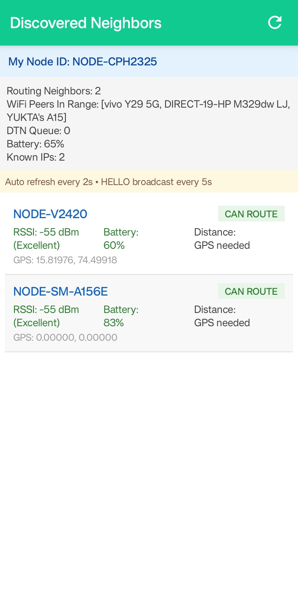
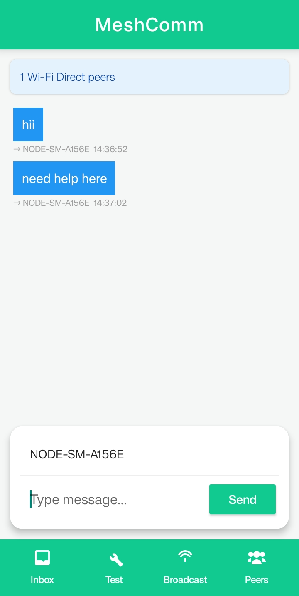
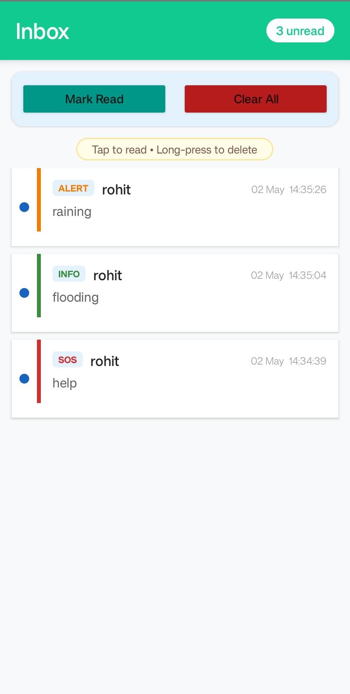
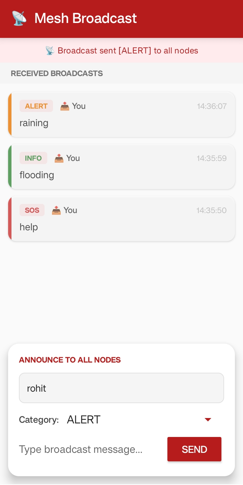

# MeshComm — Offline Mesh Messaging for Android

<p align="center">
  
  
  
  
</p>

> **Send messages between Android phones with no internet, no SIM card, and no infrastructure — using only Wi-Fi Direct and Bluetooth.**

---

## What is MeshComm?

MeshComm is an Android application that turns every phone into a **mesh network node**. Messages hop from device to device until they reach their destination, even across multiple phones acting as relays.

```
Phone A ──── Phone B ──── Phone C
  │                          │
  └──── sends message ───────►
         (routed via B)
```

This makes communication possible in scenarios where normal infrastructure fails:
- Natural disasters (earthquake, flood)
- Remote areas with no cell coverage
- Protest situations
- Emergency rescue operations
- Camping / hiking trips

---

## Features

| Feature | Description |
|---------|-------------|
| **Wi-Fi Direct Mesh** | Devices auto-discover and connect using Wi-Fi Direct P2P |
| **Bluetooth Fallback** | If Wi-Fi fails, messages route over Bluetooth RFCOMM |
| **Multi-hop Routing** | Messages travel up to 10 hops across relay nodes |
| **Smart Next-Hop** | Picks the best relay using RSSI (60%) + Battery (40%) score |
| **2-Hop Topology** | HELLO packets carry neighbor lists so nodes learn 2-hop topology |
| **DTN Store & Forward** | Messages stored locally and retried when new nodes appear |
| **Broadcast Mode** | Flood a message to every reachable node in the mesh simultaneously |
| **ACK Confirmation** | Delivery acknowledgement routed back to the original sender |
| **Inbox** | All received messages persisted to local Room database |
| **Zero Internet** | Works completely offline — no servers, no cloud |

---

## How It Works

### 1. Discovery
Every device continuously scans for nearby peers using Wi-Fi Direct. When found, it attempts connection while requesting the **Group Owner (GO)** role — acting as a mini Wi-Fi hotspot so multiple clients can connect simultaneously.

### 2. HELLO Beacons
Every 5 seconds, each node broadcasts a HELLO packet to all its neighbors:

```json
{
  "packetType": "HELLO",
  "nodeId": "NODE-CPH2325",
  "latitude": 15.775,
  "longitude": 74.481,
  "batteryLevel": 78,
  "timestamp": 1777055191,
  "neighbors": ["NODE-SM-A156E", "NODE-REDMI8"]
}
```

The embedded `neighbors` list lets receivers learn **2-hop topology** — nodes they cannot directly see but can reach through a relay.

### 3. Routing (RSSI + Battery Score)
When forwarding a message, the best next hop is chosen by:

```
score = (rssi + 100) / 100 × 0.6  +  battery / 100 × 0.4
```

Priority order:
1. **Direct delivery** — destination is a direct neighbor → send immediately
2. **2-hop routing** — a neighbor has the destination in their neighbor list → route via them
3. **Greedy relay** — no topology info → pick highest-scored neighbor

### 4. Multi-hop Message Flow

```
A sends "Hi" to C
  A checks: is C a direct neighbor? No
  A checks topology: B knows C → route via B
  A → B  (MSG, ttl=9)
  B checks: is C a direct neighbor? Yes
  B → C  (MSG, ttl=8)
  C delivers → saves to inbox → fires ACTION_MSG_IN
  C → B  (ACK)
  B → A  (ACK)
  A gets ✓ ACK DELIVERED
```

### 5. DTN (Delay Tolerant Networking)
If no route exists right now, messages are stored locally and retried every 10 seconds or whenever a new neighbor appears.

---

## Architecture

```
┌─────────────────────────────────────────┐
│              MeshService                │  ← Android Foreground Service
│                                         │
│  ┌──────────┐  ┌──────────┐            │
│  │ Wi-Fi    │  │Bluetooth │            │
│  │ Direct   │  │ RFCOMM   │            │
│  └────┬─────┘  └────┬─────┘            │
│       │              │                  │
│  ┌────▼──────────────▼──────┐          │
│  │      Packet Dispatcher   │          │
│  │  HELLO / MSG / ACK /     │          │
│  │  BROADCAST               │          │
│  └────┬─────────────────────┘          │
│       │                                │
│  ┌────▼──────────┐  ┌───────────────┐  │
│  │ NeighborTable │  │  MessageStore │  │
│  │ (live nodes)  │  │  (DTN queue)  │  │
│  └───────────────┘  └───────────────┘  │
│                                         │
│  ┌─────────────────────────────────┐   │
│  │         Room Database           │   │
│  │     (ReceivedMessageEntity)     │   │
│  └─────────────────────────────────┘   │
└─────────────────────────────────────────┘
         │
         ▼
┌─────────────────────────────┐
│       UI Activities         │
│  MainActivity / InboxActivity│
│  BroadcastActivity / Peers  │
└─────────────────────────────┘
```

---

## Packet Types

| Type | Direction | Purpose |
|------|-----------|---------|
| `HELLO` | Periodic broadcast | Announce presence, share battery, GPS, neighbor list |
| `MSG` | Source → Destination | Unicast message (multi-hop) |
| `ACK` | Destination → Source | Delivery confirmation (reverse path) |
| `BROADCAST` | Flood to all | One-to-all message, forwarded once per node |

---

## Project Structure

```
app/
├── src/
│   ├── main/java/com/meshcomm/
│   │   ├── service/
│   │   │   └── MeshService.java          # Core mesh networking service
│   │   ├── model/
│   │   │   ├── HelloPacket.java          # HELLO packet model
│   │   │   ├── MessagePacket.java        # Unicast message model
│   │   │   ├── AckPacket.java            # ACK model
│   │   │   ├── BroadcastPacket.java      # Broadcast model
│   │   │   └── NeighborNode.java         # Neighbor info model
│   │   ├── network/
│   │   │   ├── NeighborTable.java        # Active neighbor registry
│   │   │   ├── PacketController.java     # Packet validation
│   │   │   ├── MessageStore.java         # DTN persistent store
│   │   │   └── BroadcastManager.java     # Broadcast relay logic
│   │   ├── db/
│   │   │   ├── MeshDatabase.java         # Room database
│   │   │   ├── ReceivedMessageDao.java   # DAO for inbox
│   │   │   └── ReceivedMessageEntity.java# Inbox message entity
│   │   ├── routing/
│   │   │   └── RoutingEngine.java        # (Legacy) routing helper
│   │   └── ui/
│   │       ├── MainActivity.java         # Main screen
│   │       ├── InboxActivity.java        # Received messages
│   │       ├── BroadcastActivity.java    # Send/view broadcasts
│   │       ├── NeighborActivity.java     # Peer list
│   │       └── TestingActivity.java      # Debug tools
│   └── test/java/com/meshcomm/
│       └── service/
│           └── MeshServiceTest.java      # JUnit unit tests
└── AndroidManifest.xml
```

---

## Requirements

- Android **8.0 (API 26)** or higher
- **Wi-Fi** enabled (for Wi-Fi Direct)
- **Bluetooth** enabled (for fallback)
- **Location permission** (required by Android for Wi-Fi Direct scanning)
- **Nearby Devices permission** (Android 13+)

---

## Permissions

```xml
<!-- Wi-Fi Direct -->
<uses-permission android:name="android.permission.ACCESS_WIFI_STATE"/>
<uses-permission android:name="android.permission.CHANGE_WIFI_STATE"/>
<uses-permission android:name="android.permission.ACCESS_FINE_LOCATION"/>
<uses-permission android:name="android.permission.NEARBY_WIFI_DEVICES"/>

<!-- Bluetooth -->
<uses-permission android:name="android.permission.BLUETOOTH_SCAN"/>
<uses-permission android:name="android.permission.BLUETOOTH_CONNECT"/>

<!-- Foreground Service -->
<uses-permission android:name="android.permission.FOREGROUND_SERVICE"/>
<uses-permission android:name="android.permission.FOREGROUND_SERVICE_CONNECTED_DEVICE"/>
```

---

## Getting Started

### Clone and Build

```bash
git clone https://github.com/yourusername/meshcomm-android.git
cd meshcomm-android
```

Open in **Android Studio**, let Gradle sync, then:

```bash
./gradlew assembleDebug
```

### Install on Multiple Devices

```bash
# Install on all connected devices
adb devices | tail -n +2 | awk '{print $1}' | xargs -I{} adb -s {} install app/build/outputs/apk/debug/app-debug.apk
```

### Watch Logs

```bash
# Device 1
adb -s <DEVICE_1_SERIAL> logcat | grep MeshService

# Device 2
adb -s <DEVICE_2_SERIAL> logcat | grep MeshService
```

---

## Running Tests

```bash
# Run all unit tests
./gradlew test

# Run with detailed output
./gradlew test --info

# Run a specific test class
./gradlew testDebugUnitTest --tests "com.meshcomm.service.MeshServiceTest"
```

Tests cover:
- IP address sanitization
- Next-hop scoring formula (RSSI + battery)
- Packet serialization / deserialization (HELLO, MSG, ACK, BROADCAST)
- NeighborTable add / update / prune / size
- Packet deduplication cache
- TTL expiry logic
- 2-hop topology map behavior
- ACK reverse-path routing (prevHopMap)
- Node ID format validation
- Integration: 3-node A→B→C routing

---

## Debugging Tips

| Log message | Meaning |
|-------------|---------|
| `HELLO sent \| neighbors=0 IPs=0` | No peers found yet — check both devices are running |
| `Wi-Fi peers found: 1` | Wi-Fi Direct discovered a peer |
| `IP mapped: NODE-X -> 192.168.49.x` | TCP link established with a peer |
| `✓ DELIVERED MSG001 from=NODE-X` | Message received successfully |
| `✓ ACK DELIVERED for MSG001` | Sender confirmed delivery |
| `discoverPeers: failed reason=2` | Wi-Fi Direct BUSY — stale group, auto-cleared on restart |
| `DTN stored: MSG001` | No route now, will retry when neighbors appear |
| `Topology: NODE-B knows [NODE-C]` | 2-hop topology learned — can route A→B→C |

---

## Limitations

- **Wi-Fi Direct star topology** — one Group Owner, multiple clients. All traffic routes through the GO.
- **Battery drain** — continuous discovery and HELLO beacons consume power.
- **Android restrictions** — background service may be killed on some OEM ROMs (MIUI, One UI). Keep app in foreground for best results.
- **Range** — Wi-Fi Direct effective range ~30–50 meters. Bluetooth ~10 meters.

---

## Screenshots / Results

<p align="center">
  
  &nbsp;
  
  &nbsp;
  
  &nbsp;
  
</p>

<p align="center">
  <b>Peer Discovery</b> &nbsp;&nbsp;&nbsp;&nbsp;&nbsp;&nbsp;
  <b>Message</b> &nbsp;&nbsp;&nbsp;&nbsp;&nbsp;&nbsp;
  <b>Inbox</b> &nbsp;&nbsp;&nbsp;&nbsp;&nbsp;&nbsp;
  <b>Broadcast</b>
</p>
---

## Contributing

1. Fork the repository
2. Create a feature branch: `git checkout -b feature/your-feature`
3. Commit your changes: `git commit -m "Add your feature"`
4. Push to the branch: `git push origin feature/your-feature`
5. Open a Pull Request

---

## License

```
MIT License

Copyright (c) 2025 MeshComm Contributors

Permission is hereby granted, free of charge, to any person obtaining a copy
of this software and associated documentation files (the "Software"), to deal
in the Software without restriction, including without limitation the rights
to use, copy, modify, merge, publish, distribute, sublicense, and/or sell
copies of the Software, and to permit persons to whom the Software is
furnished to do so, subject to the following conditions:

The above copyright notice and this permission notice shall be included in all
copies or substantial portions of the Software.

THE SOFTWARE IS PROVIDED "AS IS", WITHOUT WARRANTY OF ANY KIND, EXPRESS OR
IMPLIED, INCLUDING BUT NOT LIMITED TO THE WARRANTIES OF MERCHANTABILITY,
FITNESS FOR A PARTICULAR PURPOSE AND NONINFRINGEMENT.
```

---

## Acknowledgements

- [Android Wi-Fi Direct API](https://developer.android.com/guide/topics/connectivity/wifip2p)
- [Android Bluetooth Classic](https://developer.android.com/guide/topics/connectivity/bluetooth)
- [Room Persistence Library](https://developer.android.com/training/data-storage/room)
- Inspired by **BATMAN**, **OLSR**, and **AODV** mesh routing protocols
